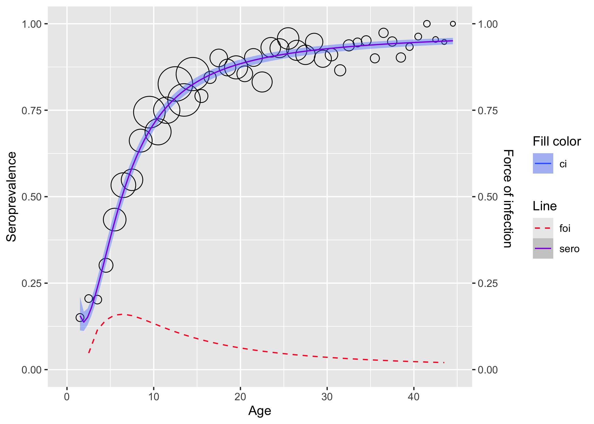
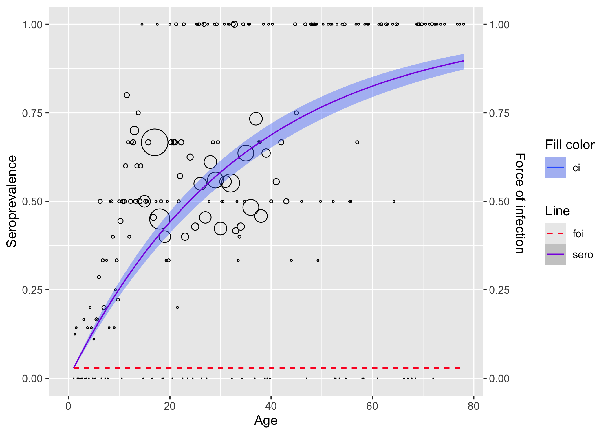
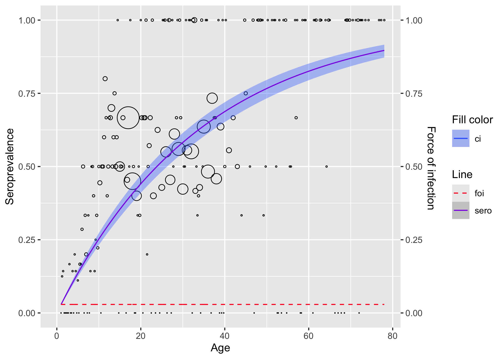

<!-- README.md is generated from README.Rmd. Please edit that file -->

# serosv 

<!-- badges: start -->

[](https://app.codecov.io/gh/OUCRU-Modelling/serosv?branch=main)
[](https://github.com/OUCRU-Modelling/serosv/actions/workflows/R-CMD-check.yaml)

<!-- badges: end -->

`serosv` is an easy-to-use and efficient tool to estimate infectious
diseases parameters (seroprevalence and force of infection) using
serological data. The current version is based on the book “Modeling
Infectious Disease Parameters Based on Serological and Social Contact
Data – A Modern Statistical Perspective” by [Hens et al., 2012
Springer](https://link.springer.com/book/10.1007/978-1-4614-4072-7).

## Installation

You can install the development version of serosv with:

``` r
# install.packages("devtools")
devtools::install_github("OUCRU-Modelling/serosv")
```

## Feature overview

### Datasets

`serosv` contains 15 built-in serological datasets as provided by [Hens
et al., 2012
Springer](https://link.springer.com/book/10.1007/978-1-4614-4072-7).
Simply call the name to load a dataset, for example:

``` r
rubella <- rubella_uk_1986_1987
```

### Methods

The following methods are available to estimate seroprevalence and force
of infection.

Parametric approaches:

- Polynomial models:
  - Muench’s model
  - Griffiths’ model
  - Grenfell and Anderson’s model
- Nonlinear models:
  - Farrington’s model
  - Weibull model
- Fractional polynomial models

Nonparametric approaches:

- Local estimation by polynomials

Semiparametric approaches:

- Penalized splines:

  - Penalized likelihood framework

  - Generalized Linear Mixed Model framework

Hierarchical Bayesian approaches:

- Hierarchical Farrington model

- Hierarchical log-logistic model

## Demo

### Fitting rubella data from the UK

Load the rubella in UK dataset.

``` r
library(serosv)
```

Find the power for the best second degree fractional polynomial with
monotonicity constraint and a logit link function. The power appears to
be (-0.9,-0.9).

``` r
rubella <- rubella_uk_1986_1987

best_2d_mn <- find_best_fp_powers(
  rubella,
  p=seq(-2,3,0.1), mc = T, degree=2, link="logit"
)

best_2d_mn
#> $p
#> [1] -0.9 -0.9
#> 
#> $deviance
#> [1] 37.57966
#> 
#> $model
#> 
#> Call:  glm(formula = as.formula(formulate(p_cur)), family = binomial(link = link))
#> 
#> Coefficients:
#>               (Intercept)                I(age^-0.9)  I(I(age^-0.9) * log(age))  
#>                     4.342                     -4.696                     -9.845  
#> 
#> Degrees of Freedom: 43 Total (i.e. Null);  41 Residual
#> Null Deviance:       1369 
#> Residual Deviance: 37.58     AIC: 210.1
```

Finally, fit the second degree fractional polynomial.

``` r
fpmd <- fp_model(
  rubella,
  p=c(-0.9, -0.9), link="logit")

plot(fpmd)
```



### Fitting Parvo B19 data from Finland

``` r
parvob19 <- parvob19_fi_1997_1998

# for linelisting data, either transform it to aggregated
transform_data(
  parvob19$age, 
  parvob19$seropositive,
  heterogeneity_col = "age") %>% 
  polynomial_model(type = "Muench") %>% 
  plot()
```



``` r

# or fit data as is
parvob19 %>% 
  rename(status = seropositive) %>% 
  polynomial_model(type = "Muench") %>% 
  plot()
```


